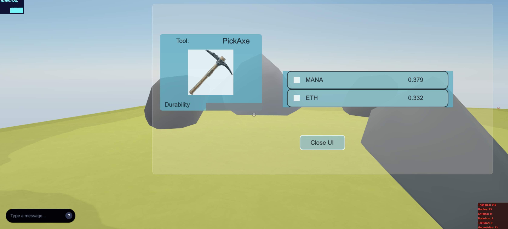

## Mining rocks

This simple scene shows how to create a custom UI.




This scene shows you:
- How to create a UI canvas
- How to add simple elements like text and rectangles to the UI
- How to add images to the UI
- How to trigger actions from clicking on UI elements
- How to open and close the UI
- How to display a bar in-world over an entity that is filled up gradually


## Try it out

**Install the CLI**

Download and install the Decentraland CLI by running the following command:

```bash
npm i -g decentraland
```

**Previewing the scene**

Download this example and navigate to its directory, then run:

```
$:  dcl start
```

Any dependencies are installed and then the CLI opens the scene in a new browser tab.

**Scene Usage**


Click on a rock to mine it, a health bar will appear over the rock until it's fully mined. If the rock contained any valuable coins, a floating notification will appear over the rock.

You can open the UI at any moment. This displays the durability of your tool and all of the coins you have collected so far.

If your tool's durability runs out, you won't be able to mine any more.

Open the pop-up UI at any time by clicking the icon on the top-right corner. You can also open it by clicking on the cube that's in the center of the scene.


Learn more about how to build your own scenes in our [documentation](https://docs.decentraland.org/) site.

If something doesn’t work, please [file an issue](https://github.com/decentraland-scenes/Awesome-Repository/issues/new).


## Copyright info

This scene is protected with a standard Apache 2 licence. See the terms and conditions in the [LICENSE](/LICENSE) file.
